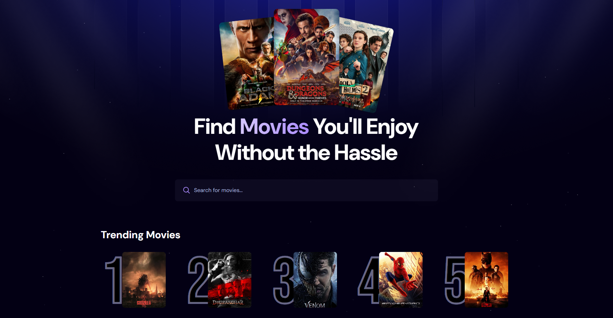
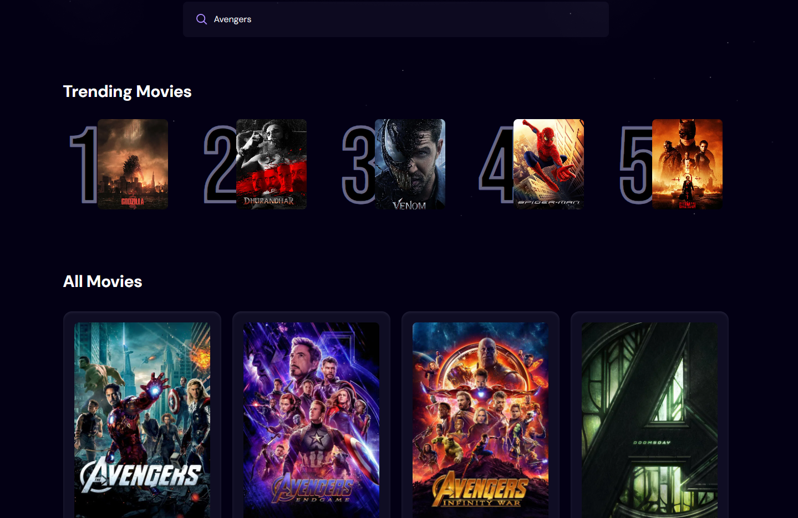
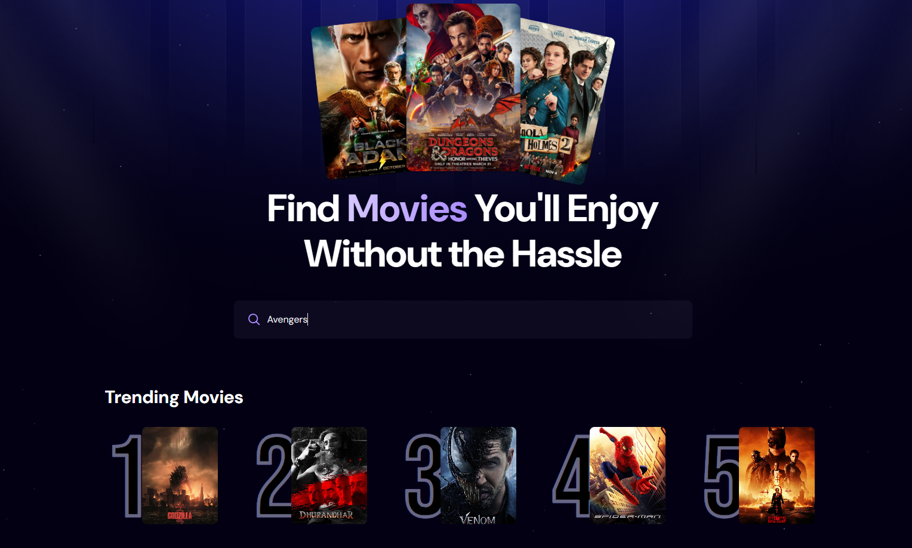

# 🎬 Movie Explorer - React Movie Discovery App

A modern, responsive, and feature-rich Movie Discovery Application built using React.js that allows users to search for their favorite movies, explore trending titles, and view detailed movie information in an intuitive and visually appealing interface.

This project demonstrates practical frontend development skills, including React Hooks, API Integration, State Management, Responsive Design, and Backend-as-a-Service integration using Appwrite.

---

## 🚀 Live Features

### 🔍 Smart Movie Search

* Search movies instantly using TMDB API
* Dynamic search results
* Real-time movie discovery experience

### 🎬 Movie Details

Each movie card displays:

* Movie Poster
* Movie Title
* Rating
* Original Language
* Release Date
* Popularity Information

### 📈 Trending Movies

* Automatically tracks user search activity
* Stores search terms in Appwrite Database
* Updates search counts dynamically
* Displays Top Trending Movies based on popularity and search frequency

### 📱 Fully Responsive Design

* Mobile Friendly
* Tablet Friendly
* Desktop Optimized
* Modern UI/UX

### ⚡ Fast Performance

* React Functional Components
* Efficient State Management
* Optimized API Calls
* Clean Component Architecture

---

# 🛠️ Tech Stack

## Frontend

* React.js
* JavaScript (ES6+)
* Tailwind CSS

## APIs & Services

### TMDB API
Link: https://developer.themoviedb.org/reference/discover-movie
Used for:

* Movie Search
* Movie Listings
* Movie Details
* Trending Data

### Appwrite

Used for:

* Database Storage
* Search Tracking
* Read Operations
* Write Operations
* Update Operations
* Trending Movie Analytics

---

# 🔥 Key React Concepts Demonstrated

### React Fundamentals

* Functional Components
* JSX
* Component-Based Architecture
* Props

### React Hooks

* useState
* useEffect
* useDebounce

### State Management

* Search State Handling
* API Response State
* Loading States
* Error Handling

### API Integration

* Fetch API
* Async/Await
* Dynamic Data Rendering

### Performance Optimization

* Conditional Rendering
* Efficient Component Updates
* Optimized API Requests

---

# 📊 Trending Movies Logic

The application tracks movie searches performed by users.

Workflow:

1. User searches for a movie
2. Search term is stored in Appwrite Database
3. Existing search records are updated
4. Search count increases automatically
5. Movies with the highest search count appear in the Trending Movies section

This demonstrates the practical implementation of:

* CRUD Operations
* Database Integration
* Analytics Tracking
* Data Aggregation

---

# ⚙️ Installation

Clone the repository:

```bash
git clone https://github.com/jaimin30j/react-movie-discovery-app.git
```

Navigate to the project:

```bash
cd project path
```

Install dependencies:

```bash
npm install
```

Start development server:

```bash
npm run dev
```

---

# 🔑 Environment Variables

Create a `.env.local` file in the project root.

```env
VITE_TMDB_API_KEY=YOUR_TMDB_API_KEY

VITE_APPWRITE_PROJECT_ID=YOUR_PROJECT_ID

VITE_APPWRITE_DATABASE_ID=YOUR_DATABASE_ID

VITE_APPWRITE_TABLE_NAME=YOUR_APPWRITE_TABLE_NAME
```

---

# 📸 Screenshots

## Home Page



## Search Results



## Trending Movies



---

# 🎥 Demo

Add Demo GIF or Video

```text
assets/demo.gif
```
---

# 🌟 Future Improvements

* Movie Detail Page
* Watchlist Feature
* User Authentication
* Genre Filtering
* Infinite Scrolling
* Movie Recommendations
* Dark Mode
* Pagination
* Favorites Management

---

# 💡 Learning Outcomes

This project helped strengthen expertise in:

* React.js Development
* Modern JavaScript
* API Integration
* State Management
* Component Reusability
* Responsive UI Development
* Appwrite Integration
* Data Persistence
* Frontend Architecture

---

# 👨‍💻 Author

## Jaimin Patel

Senior Full Stack Developer

### Core Skills

* Magento 2
* Hyvä Theme
* React.js
* GraphQL
* Tailwind CSS
* JavaScript
* PHP
* Headless Commerce
* API Integration

---

# 🎯 Project Objective

The goal of this project is to demonstrate practical React.js development skills by building a real-world movie discovery application that integrates external APIs, tracks user interactions, manages application state efficiently, and delivers an engaging user experience through a modern responsive interface.

If you found this project helpful, consider giving it a ⭐ on GitHub.
